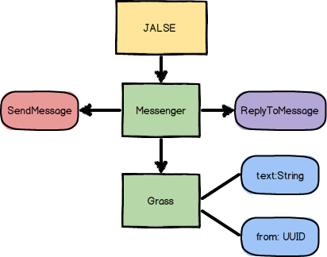

## Messengers
Messengers is a [JALSE](https://github.com/Ellzord/JALSE) example project. It is a simulation of several people text messaging each other (upon receiving a message a reply is sent back).

### Building and running with Gradle
1. Build using ```./gradlew build``` (see [Building Java Projects with Gradle](https://spring.io/guides/gs/gradle/#_build_your_project_with_gradle_wrapper))
2. Run using ```./gradle run``` (See [The Application Plugin](http://gradle.org/docs/current/userguide/application_plugin.html))

Optionally you can also create an **Eclipse** project using ```./gradlew eclipse``` (see [The Eclipse Plugins](http://gradle.org/docs/current/userguide/eclipse_plugin.html)).

### Simulation life-cycle
1. [Messenger](https://github.com/Ellzord/JALSE-Messengers/blob/master/src/main/java/messengers/entities/Messenger.java)s are created.
2. Messengers are then paired together.
3. A [SendMessage](https://github.com/Ellzord/JALSE-Messengers/blob/master/src/main/java/messengers/actions/SendMessage.java) is scheduled for each messenger.
4. A message is sent by creating a [Message](https://github.com/Ellzord/JALSE-Messengers/blob/master/src/main/java/messengers/entities/Message.java) entity.
5. Sending a messages causes [ReplyToMessage](https://github.com/Ellzord/JALSE-Messengers/blob/master/src/main/java/messengers/entities/ReplyToMessage.java) to fire sending a reply back.
6. Repeat from 4.

### Model key


### Model


### Output
See [output.txt](output.txt) (it's big).

### More
See the [Wiki](https://github.com/Ellzord/JALSE/wiki) for more information.
